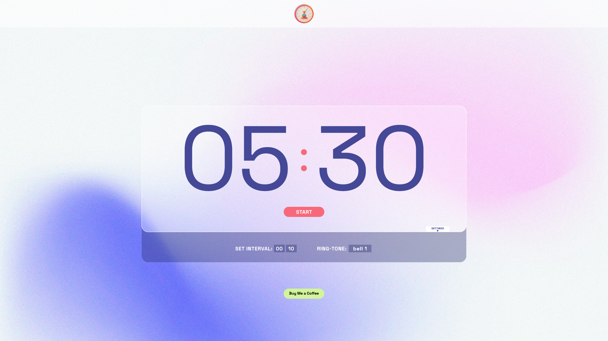

# Meditation Timer

This project is an experiment designed to help me learn TypeScript, React, and Tailwind. It was built using Next.js and is deployed on Vercel. You can use it at [Meditation Timer Online](https://www.meditationtimeronline.com/).



## Description

Meditation Timer is a simple, distraction-free timer specifically designed for meditation sessions. Unlike traditional timers that use sliders, this app allows users to set both minutes and seconds directly through a text input. Additionally, users can set intervals, and a sound will play at the end of each interval to aid in structured meditation.

### Features:

- **Custom Time Input**: Set the meditation duration by directly entering minutes and seconds.
- **Interval Timer**: Set multiple intervals during your session, and a sound will notify you when each interval ends.
- **Simple & Clean UI**: The timer is designed to be functional and self-explanatory, providing a distraction-free experience.

## Future Features:

In upcoming versions, I plan to add:

- **Sound Selection**: Choose different sounds for when the timer ends and for the interval notifications.

This is a [Next.js](https://nextjs.org/) project bootstrapped with [`create-next-app`](https://github.com/vercel/next.js/tree/canary/packages/create-next-app).

## Getting Started

First, run the development server:

```bash
npm run dev
# or
yarn dev
# or
pnpm dev
# or
bun dev
```

Open [http://localhost:3000](http://localhost:3000) with your browser to see the result.

## Deployment

The project is deployed on Vercel, and you can access it at [Meditation Timer Online](https://www.meditationtimeronline.com/).
